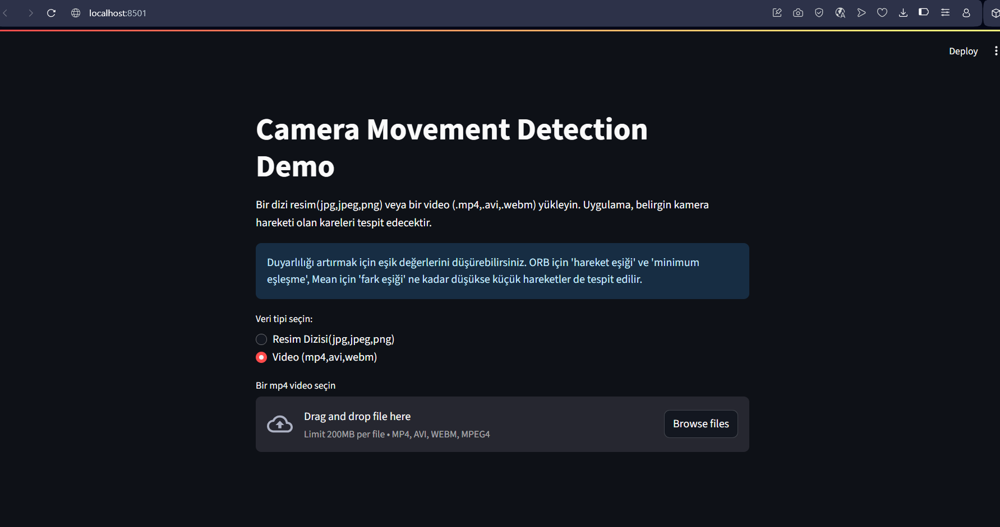
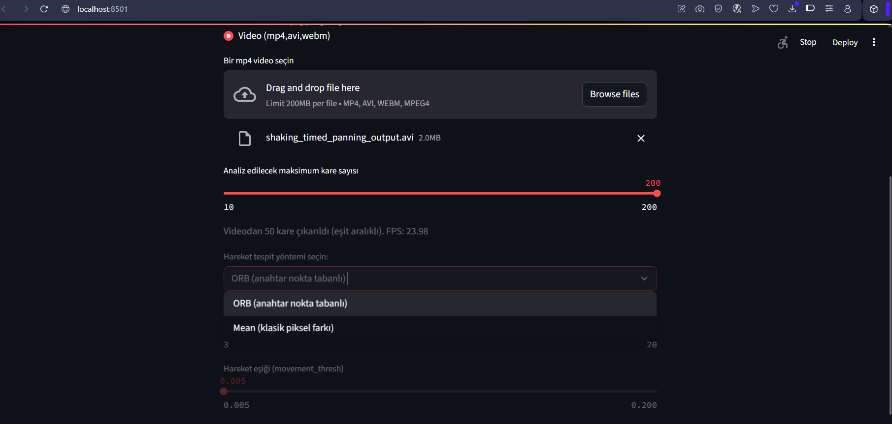
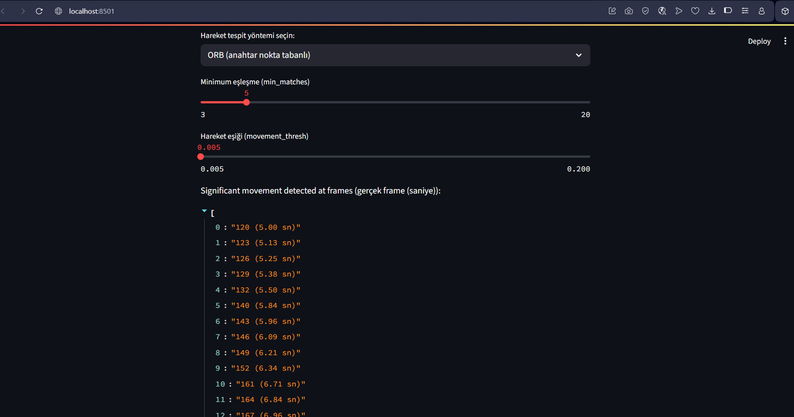
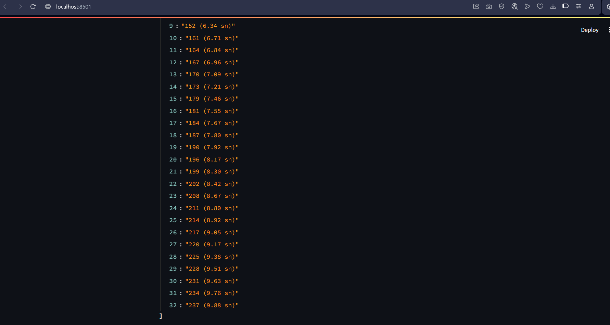
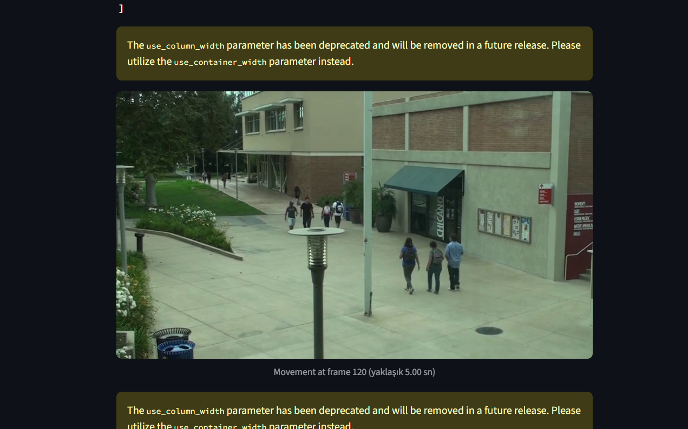
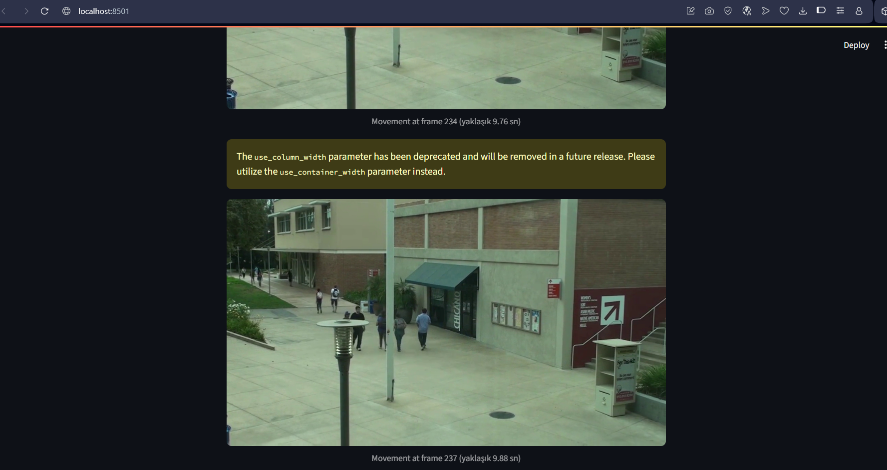

import images
# 📷 Camera Movement Detection Uygulaması

# 🔍 Genel Bakış
Bu uygulama, bir video veya bir dizi görüntü üzerinden kamerada hareketlerini tespit eder. İki farklı yöntemle çalışır:

1. Mean Difference: Ardışık kareler arasındaki ortalama piksel farkını ölçer.
2. ORB: Görüntüler arasındaki anahtar noktaları eşleştirerek kamera hareketini belirler.

Uygulama Streamlit ile geliştirildi ve kullanıcıya basit bir arayüz sunmaktadır.

---

# 🧠 Mantık ve Yaklaşım
Mean Tabanlı Algılama: Görüntüler gri tonlamaya çevrilerek ardışık kareler arasındaki farkın ortalaması alınır. Belirli bir eşik değeri (örneğin 50) aşılırsa o kare "hareketli" olarak işaretlenir.
ORB: ORB (Oriented FAST and Rotated BRIEF) kullanılarak her karedeki özellikler çıkarılır. Bu özellikler eşleştirilerek hareket olup olmadığı belirlenir.

# ⚠️ Varsayımlar ve Zorluklar
ORB yönteminde eşleştirme sayısı azsa sonuçlar tutarsız olabilir.
Işık değişimi gibi faktörler "hareket" olarak algılanabilir.
Mean yöntemi, daha basit ama daha hassastır; bu yüzden yanlış pozitif üretebilir.

🚀 Nasıl Çalıştırılır (Yerel Kurulum)

# Github'dan projeyi klonlamak için
git clone https://github.com/ferhataydin94/camera-movement-detection

# Proje Dosyasının içine girmek için
cd camera-movement-detection

# Gerekli paketleri yüklemek için
pip install -r requirements.txt

# Uygulamayı çalıştırmak için
streamlit run app.py

# 🌐 Canlı Uygulama (Public URL)
[https://camera-movement-detection-lfjbsxvgw4hyccvim9j5wy.streamlit.app]

# 🧪 Örnek Girdi / Çıktı
Girdi: Video(mp4,avi,webm) veya resim dizisi (JPG,JPEG,PNG)
[shaking_timed_panning_output.mp4](sample_video/shaking_timed_panning_output.mp4)
Çıktı: Hareket tespit edilen karelerin index sayısı, videodaki zamanı, o anki görüntüsü

Uygulamaya başta girdi olarak resim veya video seçerek girdiyi yüklüyoruz.
Ardından hangi hareket tespit alogoritması ile çalışacağımızı seçiyoruz.
Ardından hareket eşiği, minimum eşleme ve maksimum kare sayısı değerlerini girerek sonuçları alıyoruz.
ORB için 'hareket eşiği' ve 'minimum eşleşme', Mean için 'fark eşiği' ne kadar düşükse küçük hareketler de tespit edilir

# 📁 GitHub Repo
[https://github.com/ferhataydin94/camera-movement-detection]
